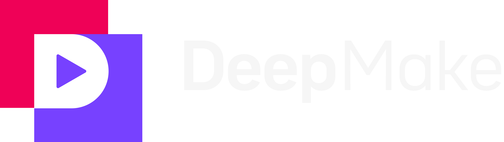

# DeepMake

DeepMake uses generative AI make content creation fast and easy. We leverage the leading open source AI to give you VFX in a few clicks, create stock video from text prompts, instantly segment layers, and more.

# Youtube

  

# Features

Empower your creativity by giving After Effects generative AI abilities.

# Support

For support please  or visit [our support page](https://deepmake.com/support).

# DeepMake Backend

This repo contains the backend for DeepMake software.  It requires host plugins (Such as our After Effects plugin) as well as processing plugins (such as our Diffusers plugin for Text to Image generation)

# Installation

We're constantly working to make installation easier to use.

## Install the DeepMake Backend

The first step is to install the DeepMake Backend.

### Easy install

#### MacOS (Apple Silicon only)
For Mac OS we have an easy installer available.  Simply run the following command.  When it asks you for "password" you need to enter your Mac login password so it can install in the correct folders.

`curl -s -L https://raw.githubusercontent.com/DeepMakeStudio/DeepMake/main/install_mac.sh -o install_mac.sh && sudo sh ./install_mac.sh`

It should handle all the installation steps for the backend and you can continue to [Install any processing plugins you want](#Install any processing plugins you want)

#### Windows
Our Windows Installer will handle installing all required components and getting Deepmake running on your system.

[Download the Installer](https://github.com/DeepMakeStudio/DeepMake/releases/latest/download/DeepMake_Win_Installer.exe)

After installation, you can continue to [Install any processing plugins you want](#Install any processing plugins you want)

### Manual Install
For the most up-to-date instructions for manual installation, please see the [installation guide on our website](https://deepmake.com/install/#manual-installation)

#### Backend Install
* Clone this folder somewhere you can access it.
* Install Anaconda from [here](https://www.anaconda.com/download)
* From the DeepMake folder, 
    * Run "conda env create -f environment.yml"

#### Install the Host plugins you want
* Windows
    * After Effects:
        * Download the [Binaries_Win.zip](https://github.com/DeepMakeStudio/DeepMake/releases/download/0.1.1-alpha/Binaries_Win.zip) file.
        * From that zip file
            * Install DeepMake_ae.aex to your After Effects plugin folder (`C:\Program Files\Adobe\Common\Plug-ins\7.0\MediaCore\`)
            * Install appPrompt.exe to the following folder (You may need to make the folder to put the file in) `C:\Program Files\DeepMake\Prompt\bin\appPrompt.exe`
    * Nuke: Coming Soon
* Mac:
    * After Effects:
        * Download the [Binaries_Mac.zip](https://github.com/DeepMakeStudio/DeepMake/releases/download/0.1.1-alpha/Binaries_Mac.zip) file.
        * From that zip file
            * Install DeepMake_ae.bundle to your After Effects plugin folder (`/Library/Application Support/Adobe/Common/Plug-ins/7.0/MediaCore/`)
            * Install appPrompt.app to the following folder `/Applications/`
    * Nuke: Coming Soon

#### Install any processing plugins you want
* go to the DeepMake folder
* cd to plugin
* git clone any processing plugins that you want to download (I.E. `git clone https://github.com/DeepMakeStudio/Diffusers`)
    * Win: Run `conda env create -f plugin/{folder}/environment.yml` for each package in the plugin folder.  (I.E. `conda env create -f plugin/Diffusers/environment.yml`)
    * Mac: Run `conda env create -f plugin/{folder}/environment_mac.yml` for each package in the plugin folder.  (I.E. `conda env create -f plugin/Diffusers/environment_mac.yml`)

Congratulations!  You've installed DeepMake.  You can add new processing plugins as they become available.

#### Run the Backend
When you install manually, you must manually start the backend for the host plugins to be able to work.

* Open an Anaconda Prompt in your DeepMake folder.
* run `conda activate deepmake`
* Run `python startup.py`
You can then run the plugin in your host software.

# Usage

Now that you've completed installation you're ready to use DeepMake

First run the backend.

* Open an Anaconda Prompt in your DeepMake folder.
* run `conda activate deepmake`
* Run `python startup.py`
* Confirm the backend started successfully, then open the host plugin.

## After Effects

To use DeepMake simply activate the plugin from Effects/DeepMake/AI Plugin Renderer

Then you may choose from the installed plugins.  Each processing plugin will have it's own settings for you to configure.  DeepMake automatically makes the options that each processning plugin use visibile for you to modify.

## For more

For more information or if you want to get more help see [DeepMake.com](https://deepmake.com/) or join our [Discord server](https://discord.gg/E6T5t7mE8T)

New Guides, Videos, and tutorials will be released over time.
